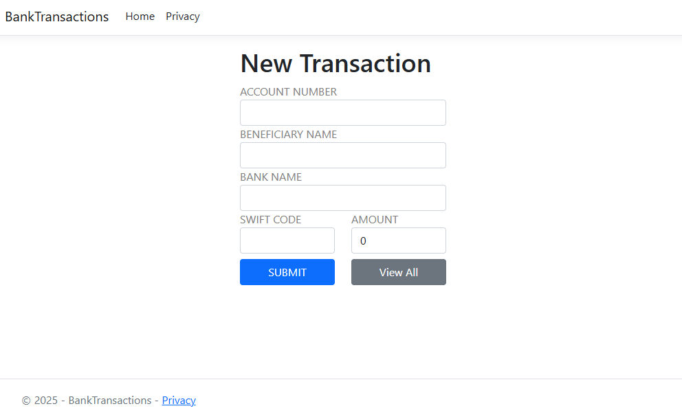
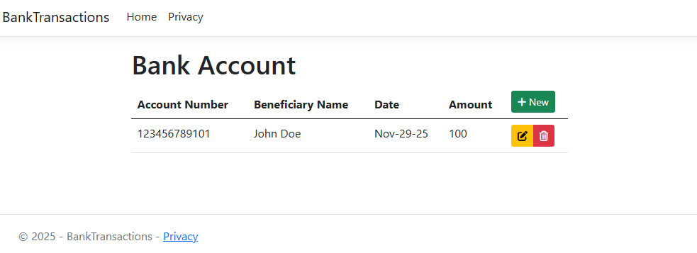

# ASP.NET Core MVC Project – BankTransactions with CRUD Operations using Entity Framework Core

## Objective  
The purpose of this ASP.NET Core MVC project is to build a fully functional **Bank Transaction Management System** that supports complete **CRUD operations** (Create, Retrieve, Update, Delete).  
Users can input and manage transactions through form-based pages, with all data stored in a **SQL Server** database using **Entity Framework Core**.

This project is based on concepts from the CodAffection tutorial:  
👉 **[Asp.Net Core MVC CRUD Operations with EF Core](https://www.youtube.com/watch?v=VYmsoCWjvM4)**

## Skills Learned

- **Controller:**  
  - Managed routing, HTTP request handling, and action methods in `TransactionController.cs`.  
  - Implemented full CRUD logic connected to EF Core.

- **View:**  
  - Designed Razor views: `Index`, `Create`, `Edit`, `Details`, and `Delete`.  
  - Used `_Layout.cshtml` for consistent UI with Bootstrap styling.

- **Model:**  
  - Created a strongly typed model with data annotation validation.  
  - Learned how EF Core maps the model to SQL Server tables.

- **Data Integration:**  
  - Configured `TransactionDbContext.cs` to handle database operations.  
  - Performed EF Core migrations to generate and maintain the database schema.  
  - Viewed and verified stored data using SQL Server Management Studio (SSMS).

## Project Setup Steps

## 1. Install Required NuGet Packages  
  - Microsoft.EntityFrameworkCore 
  - Microsoft.EntityFrameworkCore.Tools
  - - Microsoft.EntityFrameworkCore.SqlServer  

## 2. Configure SQL Server Connection String  

#### DB Connection String References

- **MSDN:** [https://bit.ly/3wQFY1T](https://bit.ly/3wQFY1T)  
- **CSharp.net:** [https://bit.ly/3J79raF](https://bit.ly/3J79raF)

---
Add your SQL Server connection string in **appsettings.json**:

```json
"ConnectionStrings": {
  "DevConnection": "Server=localhost;Database=TransactionsDB;Trusted_Connection=True;MultipleActiveResultSets=true;TrustServerCertificate=True"
}
```
Configure DbContext in Program.cs  

```csharp
// Depnedency injection for DbContext 
builder.Services.AddDbContext<TransactionDbContext>(options =>
    options.UseSqlServer(builder.Configuration.GetConnectionString("DevConnection")));
``` 
## 3. Create and Apply Entity Framework Core Migrations for the Database

Open **Package Manager Console**:

### Create the migration
```powershell
Add-Migration "Initial Create"
```
```powershell
Update-Database
```

## Images of BankTransactions User Interface

#### New Transaction Form


#### Bank Account Details

